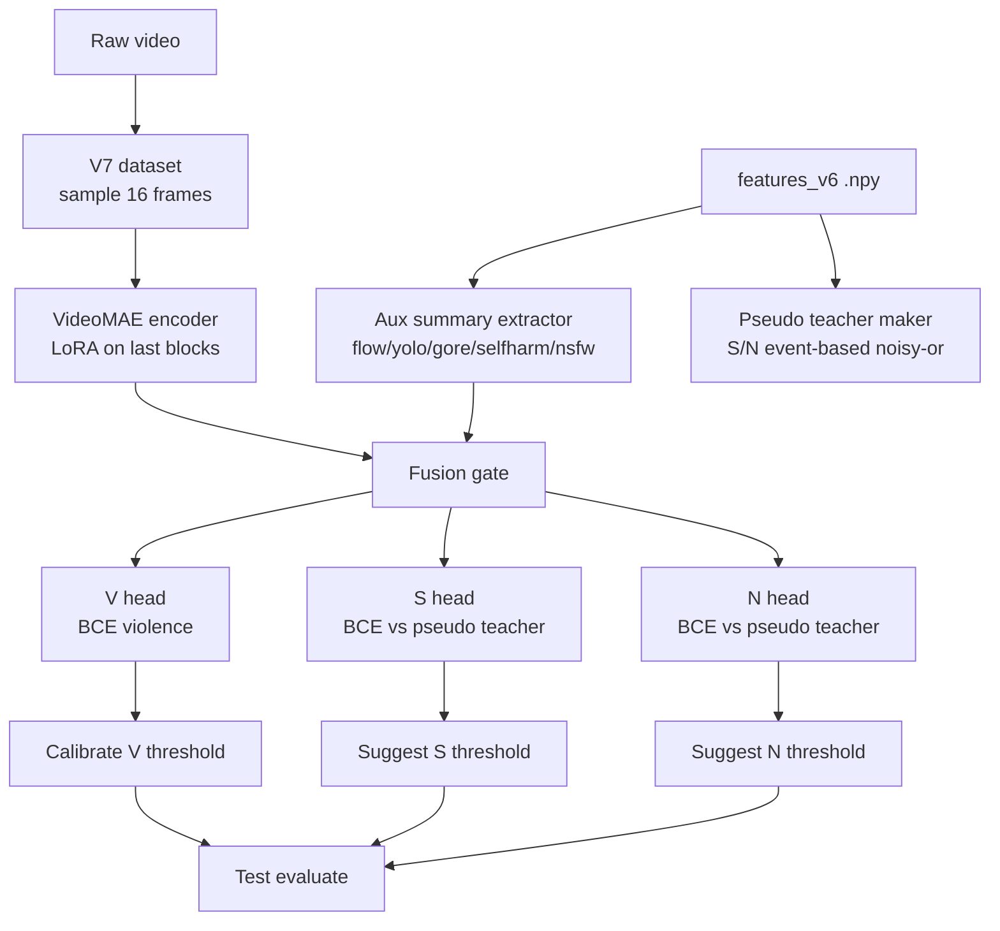
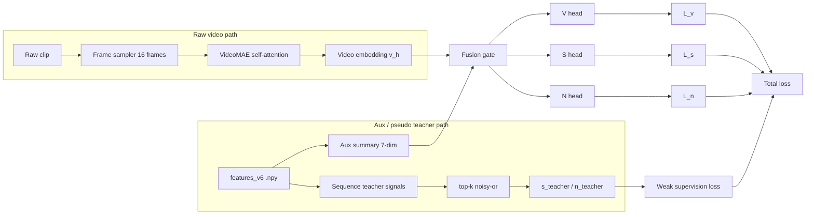

# Mo ta model V7 - VideoMAE + LoRA + Gate Fusion + Weak Distillation

> Tai lieu nay mo ta pipeline V7 hien tai cua do an: video-native backbone, aux summary tu feature cache V6, pseudo-teacher cho S/N, va quy trinh train/calibrate/evaluate theo manifest.

## 1. Muc tieu cua V7

V7 duoc tao ra de giai quyet 3 van de chinh cua V6:

1. **Violence bi false positive cao** do CLIP feature de hoc shortcut theo semantic va chat luong video.
2. **Video quality shortcut** lam model hoc "mo / CCTV / nhieu noise" thay vi hoc hanh vi that.
3. **S/N can co ban chat event-based** thay vi bi trung binh hoa qua manh theo toan bo clip.

Huong giai quyet cua V7 la:

- dung **VideoMAE** lam backbone video-native thay cho CLIP frame-wise
- dung **LoRA** de fine-tune nhe tren GPU han che
- giu **aux evidence** tu feature cache V6 (YOLO / Gore / SelfHarm / NSFW / flow summary)
- dung **gate fusion** de tron video embedding va aux summary
- dung **pseudo teacher** cho S/N theo kien truc event-based

## 2. Trang thai hien tai cua pipeline

Trong codebase hien tai, V7 da co day du 3 ham chinh:

- train: [scripts/train_v7_videomae_lora.py](scripts/train_v7_videomae_lora.py)
- calibrate: [scripts/calibrate_v7.py](scripts/calibrate_v7.py)
- evaluate: [scripts/evaluate_v7.py](scripts/evaluate_v7.py)

Va co 2 thanh phan du lieu / mo hinh phu tro:

- dataset: [src/data/video_moderation_v7_dataset.py](src/data/video_moderation_v7_dataset.py)
- model: [src/models/v7_videomae_lora.py](src/models/v7_videomae_lora.py)

**Diem can luu y quan trong:**

- V7 **bat buoc** can raw video de train backbone VideoMAE.
- `.npy` feature tu Cell 5 cua V6 **khong the thay the raw video**.
- `features_v6` chi duoc tai su dung lam:
  - `aux_summary` cho gate fusion
  - pseudo teacher cho `S` va `N`

## 3. Bang thanh phan trong pipeline V7

| Thanh phan | File | Dau vao | Dau ra | Muc dich | Ghi chu khoa hoc |
|---|---|---|---|---|---|
| V7 split manifest | [scripts/prepare_video_manifests_v7.py](scripts/prepare_video_manifests_v7.py) | `train/val/test_manifest.csv`, `features_manifest.csv` | `*_video_manifest.csv` | Map split cu sang manifest video-level cho V7 | Can tranh sai do trung basename |
| Video dataset | [src/data/video_moderation_v7_dataset.py](src/data/video_moderation_v7_dataset.py) | `video_path`, optional `feature_path` | `pixel_values`, `aux_summary`, `s_teacher`, `n_teacher` | Doc raw video va tao pseudo-teacher tu feature cache | Raw video la dau vao chinh |
| Video backbone | [src/models/v7_videomae_lora.py](src/models/v7_videomae_lora.py) | `pixel_values [B,T,3,H,W]` | `video embedding` | Hoc bieu dien dong thoi gian native | VideoMAE duoc freeze mot phan, LoRA mo o block cuoi |
| Aux fusion gate | [src/models/v7_videomae_lora.py](src/models/v7_videomae_lora.py) | video embedding + `aux_summary [B,7]` | `fused embedding` | Ket hop video native + expert evidence | Gate dung sigmoid residual fusion |
| Violence head | [src/models/v7_videomae_lora.py](src/models/v7_videomae_lora.py) | fused embedding | `v_logit` | Du doan violence co nhan | Label supervised that |
| Self-harm head | [src/models/v7_videomae_lora.py](src/models/v7_videomae_lora.py) | fused embedding | `s_logit` | Du doan self-harm | Hoc theo pseudo teacher / weak supervision |
| NSFW head | [src/models/v7_videomae_lora.py](src/models/v7_videomae_lora.py) | fused embedding | `n_logit` | Du doan NSFW | Hoc theo pseudo teacher / weak supervision |
| Train loop | [scripts/train_v7_videomae_lora.py](scripts/train_v7_videomae_lora.py) | train/val manifests + raw video + features cache | checkpoint, metrics | Toi uu V, S, N dong thoi | Co sampler cho violence va gradient accumulation |
| Threshold calibration | [scripts/calibrate_v7.py](scripts/calibrate_v7.py) | val manifest + checkpoint | `t_v`, `t_s`, `t_n` de xuat | Chon nguong truoc test | Violence optimize F2, S/N theo upper-tail policy |
| Final evaluation | [scripts/evaluate_v7.py](scripts/evaluate_v7.py) | test manifest + checkpoint | metric test, confusion matrix, score distribution | Bao cao cuoi cung | Chi dung cho test sau khi chot model |

## 4. Bang luong hoat dong cua pipeline V7

| Buoc | Dau vao | Xu ly | Dau ra | Muc dich |
|---|---|---|---|---|
| 1 | `train/val/test_manifest.csv` + `features_manifest.csv` | Tao `*_video_manifest.csv` | Manifest video-level | Gom video, giu split ro rang |
| 2 | `video_path` | Sample `num_frames=16`, resize, normalize | `pixel_values [T,3,H,W]` | Tao clip raw video cho VideoMAE |
| 3 | `feature_path` | Doc `.npy` V6, rut ra mean/max theo channel | `aux_summary [7]` | Giu expert evidence nhung khong phu thuoc CLIP |
| 4 | `aux_summary` | Tao pseudo teacher `s_teacher`, `n_teacher` bang event-based noisy-or | `s_teacher`, `n_teacher` | Weak supervision cho S/N |
| 5 | `pixel_values` | VideoMAE encoder + LoRA | `video embedding` | Hoc temporal semantics video-native |
| 6 | `video embedding` + `aux_summary` | Fusion gate | `fused embedding` | Tranh video embedding bi loi keo boi aux |
| 7 | fused embedding | 3 head rieng | `v_logit`, `s_logit`, `n_logit` | Multi-task prediction |
| 8 | `v_logit`, `s_logit`, `n_logit` | Loss + backward | checkpoint | Train doc lap nhung co chia se latent |
| 9 | val logits | Calibrate nguong | `t_v/t_s/t_n` | Chot threshold tren val, khong dung test |
| 10 | test logits | Evaluate | metric test | Bao cao cuoi cung |

## 5. So do tong the de ve hinh



## 6. So do ben trong model de ve hinh

```mermaid
flowchart TD
    X[pixel_values\n[B,T,3,H,W]] --> VMAE[VideoMAE]
    VMAE --> CLS[temporal token / pooled video embedding]

    A[aux_summary\n[B,7]] --> LP[aux proj]
    CLS --> VP[video proj]

    VP --> CAT[concat video + aux]
    LP --> CAT

    CAT --> SG[sigmoid gate\nresidual fusion]
    SG --> FN[LayerNorm]

    FN --> VH[V head]
    FN --> SH[S head]
    FN --> NH[N head]

    VH --> VLOGIT[v_logit]
    SH --> SLOGIT[s_logit]
    NH --> NLOGIT[n_logit]
```

## 7. Co che gate, cross-attn va KD

### 7.1. Gate fusion trong V7

Trong V7, co che ket hop chinh la:

$$
fused = LN\big(v_h + \sigma(W[v_h;a_h]) \odot a_h\big)
$$

Trong do:

- `v_h`: video embedding tu VideoMAE
- `a_h`: aux embedding tu expert summary
- `\sigma(...)`: gate sigmoid
- `LN`: LayerNorm

Y nghia:

- video embedding giu vai tro chu dao
- aux embedding chi duoc dua vao khi co loi ich
- neu aux khong huu ich, gate tu dong giam muc dong gop cua no

### 7.2. Cross-attn: di san tu V6, khong con la truc chinh cua V7

V6 dung **two-way cross-attention** cho tung gate:

- token truy van frame
- frame phan hoi lai token
- sinh saliency map theo thoi gian

Day la co che hop ly khi dau vao la chuoi feature frame-level.

V7 thay doi the hien:

- khong con lay CLIP frame-wise lam backbone chinh
- khong con dung cross-attn la truc xu ly trung tam
- thay vao do, VideoMAE hoc temporal token native, sau do gate fusion voi aux summary

**Ket luan:** cross-attn la di san khoa hoc quan trong cua V6, con V7 la buoc nang cap sang video-native, niem yeu cua no la fusion gate thay cho cross-attn trung tam.

### 7.3. KD / weak distillation trong V7

V7 khong con dung KL distillation attention-map nhu V6. Thay vao do, no dung **pseudo teacher supervision**:

- `s_teacher` lay tu summary cua SelfHarm / Gore feature cache
- `n_teacher` lay tu summary cua NSFW feature cache
- `s_logit`, `n_logit` hoc bang BCE voi pseudo label nay

Co the hieu day la mot dang **weak KD**:

- teacher khong phai video-level ground truth day du
- teacher la expert signal da duoc nen lai tu feature cache
- hoc sinh la VideoMAE + gate fusion

### 7.4. So sanh nhanh V6 va V7 ve gate / KD

| Khia canh | V6 | V7 current | Y nghia |
|---|---|---|---|
| Cach hoc temporal | Two-way cross-attention giua task token va frame token | VideoMAE self-attention ben trong backbone | V7 giu temporal reasoning nhung doi sang video-native |
| Gate | V/S/N pool rieng, task token rieng | Fusion gate giua video embedding va aux summary | V7 don gian hon, it phu thuoc feature hand-crafted |
| CLIP shortcut | CLIP co the nuot signal khac | CLIP frame-wise khong con la backbone chinh | Giam rui ro quality/semantic shortcut |
| KD / teacher | KL distillation giua saliency va expert soft labels | Pseudo teacher S/N tu feature cache + BCE | Van co y tuong distillation, nhung dong thoi phu hop voi du lieu khong co label video-level day du |
| S/N scoring | Weighted mean hoac top-k noisy-or | top-k noisy-or trong pseudo teacher va calibration | Bat event ngan tot hon |

### Ghi chu quan trong ve cross-attn

Cross-attn la co che rat hay o V6, nhung trong V7 no khong con nam o runtime core nua. Ly do la:

1. VideoMAE da hoc self-attention theo thoi gian.
2. V7 can giam phu thuoc CLIP frame-wise.
3. V7 can model nhe hon, de train hon, phu hop GPU han che.

Noi cach khac:

- **V6**: task token hoi frame token.
- **V7**: backbone video-native hoi chinh clip, con gate chi dung de dinh huong signal phu.

### Ghi chu quan trong ve KD

KD trong V7 hien tai khong phai KD kieu "teacher video-level day du". No la:

- lay feature cache V6 lam nguon pseudo teacher
- bien teacher thanh event score
- day score do vao S/N heads bang BCE

Day la mot dang **weak distillation** hop ly khi bai toan khong co nhan video-level day du cho Self-harm va NSFW.

## 8. So do gate + pseudo KD de ve hinh



Neu can ve de hieu hon, co the lay Y tuong ve 2 lop:

1. Lop 1: raw video -> VideoMAE -> video embedding.
2. Lop 2: feature cache V6 -> aux summary + pseudo teacher -> gate + weak supervision.

## 9. Nhan dinh tinh khoa hoc cua pipeline V7

### 9.1. Diem manh khoa hoc

1. **Co hypothesis ro rang**: false positive Violence khong chi la loi classifier, ma con la loi shortcut do CLIP va chat luong video.
2. **Co tac dong truc tiep vao confounder**: thay backbone video-native de giam shortcut, thay vi chi sua nguong.
3. **Co co che phu hop du lieu that**: S/N khong co label day du, nen dung pseudo teacher thay vi ep supervised sai nguoi, sai bai toan.
4. **Co tinh tiep noi giua V6 va V7**: V6 sinh expert signals, V7 tai su dung chung mot cach co kieu truc, khong phai choang bo tat ca.
5. **Co kiem soat compute**: LoRA giu trainability tren GPU han che.

### 9.2. Chien luoc he thong

Pipeline nay co chien luoc ro rang:

- **Stage separation**: expert, feature cache, video-native fine-tune, calibration, evaluation.
- **Risk reduction**: freeze backbone, LoRA only, thuc nghiem nho truoc.
- **Modular reuse**: khong bo toan bo output V6, ma dung lai phan co gia tri lam signal phu.
- **Decision discipline**: val dung de chon threshold, test dung de chot ket qua.

### 9.3. Thanh tuu da dat duoc

1. **Giam phu thuoc CLIP frame-wise**: day la thanh tuu lon nhat ve mat kien truc.
2. **Doi event scoring cho S/N**: phu hop hon voi moderation, vi event ngan khong bi loang.
3. **Giup Violence tro nen video-native hon**: thay vi xem tung frame don le, model hoc clip.
4. **Lam cho V7 dat duoc tren GPU khiem ton**: LoRA giup huan luyen khong can full fine-tune.
5. **Xay duoc cau noi giua expert signals va end model**: khong mat cong suc tao expert model o V6.

### 9.4. Gioi han con lai

1. **S/N van la weak supervision**: chua co video-level ground truth day du.
2. **Quality shortcut chua the xem la xoa hoan toan**: doi backbone giup nhieu, nhung van can kiem tra augmentation va domain shift.
3. **V7 phu thuoc vao raw video**: features V6 khong the thay the clip goc.
4. **Mapping manifest phai rat chat**: neu feature path trung basename, co the sinh sai mapping neu khong check ky.

## 10. Ket luan ngan

V7 hien tai da chuyen he thong tu mot pipeline frame-semantic/CLIP-heavy sang **video-native moderation pipeline**. Thanh phan khoa hoc dang gia nhat la:

- VideoMAE + LoRA de hoc temporal representation
- fusion gate de khong cho aux signal nuot mat video signal
- pseudo KD / event teacher de giu S/N dung ban chat moderation

Neu noi ngan gon:

**V6 cho chung ta co co che gate va KD. V7 giu lai tu tuong do, nhung noi no vao backbone video-native de giam shortcut va phu hop hon voi hanh vi bao luc thay doi theo thoi gian.**